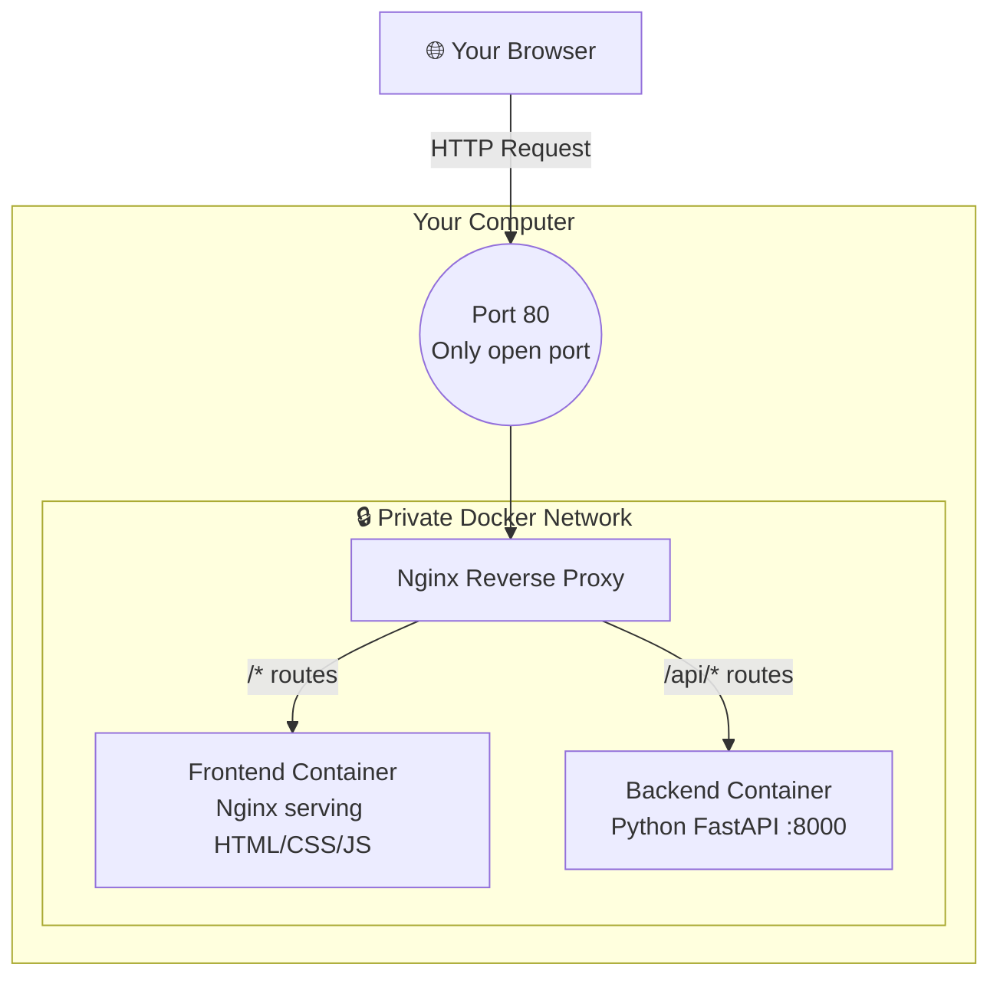

# 🎓 EventSphere — Campus Event & Ticketing System

> A beginner-friendly, fully containerised full-stack web application demonstrating modern DevOps practices with **Docker**, **Nginx**, and **Python FastAPI**.

---

## 🚀 Quick Start (You only need Docker!)

```bash
# 1. Clone the repo
git clone https://github.com/Mukasshaf/EventSphere-campus-events-platform.git
cd EventSphere-campus-events-platform

# 2. Start the app (first time takes ~1 min to download images)
docker-compose up --build -d

# 3. Open your browser
http://localhost
```

**To stop it:**
```bash
docker-compose down
```

> ✅ You do **not** need Python, Node.js, or anything else — just Docker Desktop.

---

## 🧱 What Does This Project Teach?

This project is designed to teach the fundamentals of **DevOps and Cloud deployment** by building a real application from scratch. You'll learn:

| Concept | What You'll See |
|---|---|
| **Containerisation** | Each part of the app (backend, frontend) runs in its own isolated Docker container |
| **Reverse Proxy** | Nginx routes all traffic — users only ever touch port 80 |
| **Network Isolation** | The backend is never directly exposed to the internet |
| **Environment Variables** | Configuration is injected at runtime, not hardcoded |
| **Production Patterns** | `restart: always`, separate services, clean Dockerfile layers |

---

## 📁 Project Structure

```
EventSphere/
├── backend/              # Python FastAPI API server
│   ├── main.py           # All API routes (events, registrations)
│   ├── requirements.txt  # Python dependencies
│   └── Dockerfile        # How to build the backend container
│
├── frontend/             # Static HTML/CSS/JS site
│   ├── index.html        # App shell + modal layouts
│   ├── app.js            # All frontend logic & API calls
│   ├── style.css         # Styling (dark/light theme, responsive)
│   └── Dockerfile        # Builds an Nginx container to serve the files
│
├── nginx/
│   └── nginx.conf        # Reverse proxy routing rules
│
├── docker-compose.yml    # Orchestrates all 3 containers together
└── README.md             # You are here!
```

---

## 🏗️ Architecture



**Key security point:** Only port 80 is ever open. The backend on port 8000 is completely hidden inside Docker's private network. There is no way to access it directly from outside.

---

## ✨ App Features

### 👤 User Mode
- View all upcoming events
- Click to register with your name and email

### 🛠️ Admin Mode
- Toggle to Admin using the top-right switch
- Create new events
- Edit existing events
- View all registrations per event

---

## 🔍 Key Files Explained

### `docker-compose.yml`
This is the **master orchestration file**. It defines:
- Which containers to run
- How they connect to each other (via `app_network`)
- Which ports are exposed to the outside world (only port 80!)

### `nginx/nginx.conf`
The traffic controller. Any request starting with `/api/` goes to the Python backend. Everything else goes to the frontend.

```nginx
location /api/ {
    proxy_pass http://backend/api/;  # → Python FastAPI
}
location / {
    proxy_pass http://frontend;      # → Static HTML files
}
```

### `backend/main.py`
A Python [FastAPI](https://fastapi.tiangolo.com/) application with endpoints for:
- `GET /api/events` — list all events
- `POST /api/events` — create an event
- `PUT /api/events/{id}` — edit an event
- `POST /api/events/register` — register for an event
- `GET /api/events/{id}/registrations` — view registrations

### `backend/Dockerfile`
```dockerfile
FROM python:3.11-alpine    # Lightweight base image
WORKDIR /app
COPY requirements.txt .
RUN pip install -r requirements.txt
COPY . .
CMD ["uvicorn", "main:app", "--host", "0.0.0.0", "--port", "8000"]
```

### `frontend/Dockerfile`
```dockerfile
FROM nginx:alpine           # Nginx serves our static files
COPY . /usr/share/nginx/html
EXPOSE 80
```

---

## ☁️ Serverful vs Serverless

| | **Serverful (This Project)** | **Serverless (e.g. AWS Lambda)** |
|---|---|---|
| **Infrastructure** | You manage it (Docker containers) | Cloud provider manages it |
| **Scaling** | Manual / always running | Auto-scales to zero |
| **Cost** | Pay even when idle | Pay only for usage |
| **Cold Starts** | None | May have delays |
| **State** | In-memory store possible | Stateless only |
| **Best for** | Full control, predictable load | Event-driven, spiky traffic |

---

## 📚 Prerequisites to Learn First

If you're new, here's a suggested learning order:
1. **HTML/CSS/JavaScript basics** — how websites work
2. **Python basics** — variables, functions, HTTP
3. **REST APIs** — GET, POST, PUT requests
4. **Docker basics** — `docker pull`, `docker run`, images vs containers
5. **Docker Compose** — running multiple containers together
6. ⭐ **This project** — putting it all together!

---

## 🤝 Contributing

Feel free to fork this repo and extend it! Ideas:
- Add a real database (SQLite or PostgreSQL)
- Add user authentication
- Deploy to a cloud VM (AWS EC2, GCP, Azure)
- Add HTTPS with Let's Encrypt

---
*Built as part of a Cloud Computing & DevOps skills lab.*
